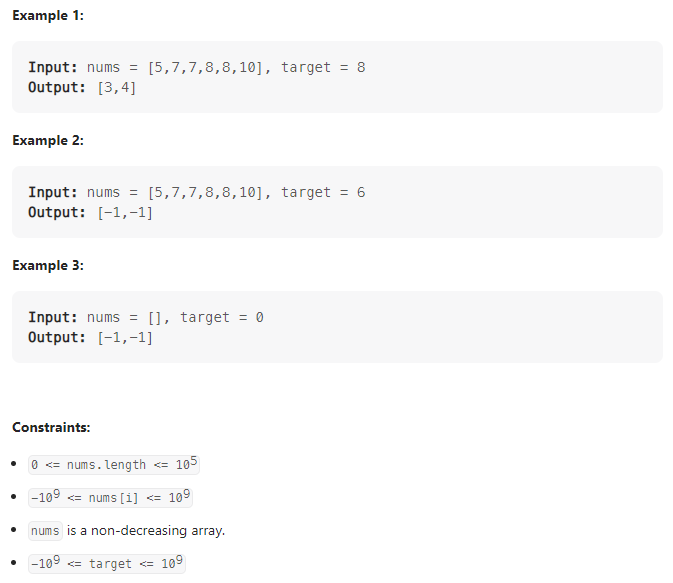

# 34: Find First and Last Position of Element in Sorted Array

Given an array of integers `nums` sorted in non-decreasing order, find the starting and ending position of a given `target` value.

If `target` is not found in the array, return `[-1, -1]`.

You must write an algorithm with `O(log n)` runtime complexity.



**Solution:**

### 1.

Using Binary Search method to find the first and last target respectively

```java

class Solution {
    public int[] searchRange(int[] nums, int target) {
        int[] ans = new int[2];
        ans[0] = findFirst(nums, target);
        ans[1] = findLast(nums, target);
        return ans;
    }
    private int findFirst(int[] nums, int target) {
        int left = 0;
        int right = nums.length - 1;
        int result = -1;
        while(left <= right) {

            int mid = left + (right - left) / 2;
            //keep searching the left part of the arr
            if(nums[mid] >= target)
                right = mid - 1;
            else
                left = mid + 1;
            if(nums[mid] == target) {
                result = mid;
            }
        }
        return result;
    }

    private int findLast(int[] nums, int target) {
        int left = 0;
        int right = nums.length - 1;
        int result = - 1;
        while(left <= right) {

            int mid = left + (right - left) / 2;

            if(nums[mid] > target)
                right = mid - 1;
            //keep searching the right part of the arr
            else
                left = mid + 1;
            if (nums[mid] == target)
                result = mid;
        }
        return result;
    }
}
```

---
