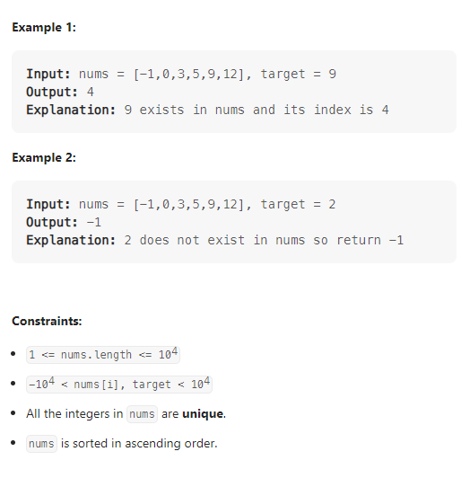

---

Given an array of integers `nums` which is sorted in ascending order, and an integer `target`, write a function to search `target` in `nums`. If `target` exists, then return its index. Otherwise, return `-1`.

You must write an algorithm with `O(log n)` runtime complexity.


**Solution:**

### 1. Left close and right close [right, left]

- Using two pointers: `left` and `right` to define the section of the arr.
- while `left <= right`
- Find the mid element of the arr, if this element larger than `target`, let `right = mid - 1`. if this element is smaller than `target`, let `left = mid + 1`
- If `arr[mid] == target` return `mid`


```java
class Solution {
    public int search(int[] nums, int target) {
        int left = 0;
        int right = nums.length-1;
        while(left <= right) {
            int mid = left + (right-left) / 2;
            if(nums[mid] < target)
                left = mid + 1;
            else if(nums[mid] > target)
                right = mid - 1;
            else
                return mid;
        }
        return -1;
    }
}
```

### 2. Left close and right open [left, right)

There are two points that different from [right, left]:

1. `while (left < right)`
2. `if(nums[mid] > target) right = mid`.


```java
class Solution {
    public int search(int[] nums, int target) {
        int left = 0, right = nums.length;
        while(left < right) {
            int mid = left + (right-left) / 2;
            if(nums[mid] < target)
                left = mid + 1;
            else if(nums[mid] > target)
                right = mid;
            else
                return mid;
        }
        return -1;
    }
}
```

---

<br/><br/>
