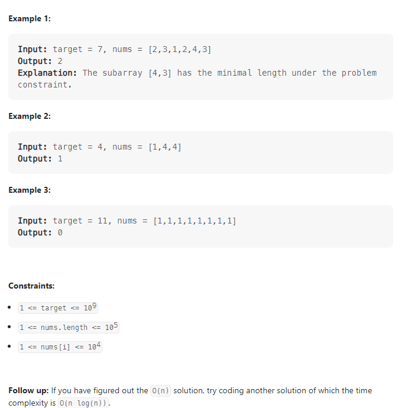

---

Given an array of positive integers `nums` and a positive integer `target`, return *the **minimal length** of a *_subarray_* whose sum is greater than or equal to* `target`. If there is no such subarray, return `0` instead.



**Solution:**

### 1. Brute Force

- using two for loops

```java

    public int minSubArrayLen(int target, int[] nums) {
        int min = Integer.MAX_VALUE;
        for(int i = 0; i < nums.length; i++) {
            int sum = 0;
            for(int j = i; j < nums.length; j++) {
                sum += nums[j];
                if(sum >= target){
                    min = Math.min(min, j-i+1);
                    break;
                }
            }
        }
        return min == Integer.MAX_VALUE ? 0 : min;
    }

```

### 2. Two Pointers

- Using `left` and `right` to define the window between `nums`
- use `sum` to record the current sum
- when the `sum` is larger or equal than the `target`, store the `min` length of the subarray then remove the left number from the sum and `left`++

```java

    public int minSubArrayLen(int target, int[] nums) {
        if(nums.length == 0) return 0;
        int left = 0;
        int right = 0;
        int min = Integer.MAX_VALUE;
        int sum = 0;
        while(right < nums.length) {
            sum += nums[right];
            while(sum >= target) {
                min = Math.min(min, right - left + 1);
                sum -= nums[left];
                left++;
            }
                right++;
        }
        return min == Integer.MAX_VALUE ? 0 : min;
    }

```

### 3. Binary Search

- use `sum[i] `to store the sum of` nums[0...i]`
- in this case, `sums[k]-sum[j] >= target`, then the length would be` k-j`. but this is not nessessary the shortest one. Therefore, we need to loop over the arr
- we can use `sum[j]+tartget <= sums[k]`;

```java

    public int minSubArrayLen(int target, int[] nums) {
        if(nums.length == 0) return 0;
        int min = Integer.MAX_VALUE;
        int[] sums = new int[nums.length+1];

        for(int i = 1; i <= nums.length; i++) {
            sums[i] = sums[i-1] + nums[i-1];

        }
        for(int i = 0; i <= nums.length; i++) {
            int _target = target + sums[i];
            int index = Arrays.binarySearch(sums, _target);
            if(index < 0)
                index = -index;
            if(index <= nums.length) {
                min = Math.min(min, index - i);
            }
        }
        return min == Integer.MAX_VALUE ? 0 : min;

    }

```

---
