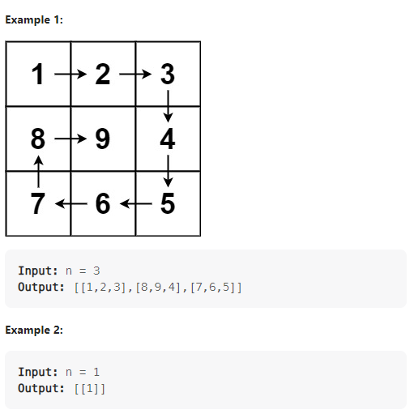

---

Given a positive integer `n`, generate an `n x n` `matrix` filled with elements from `1` to `n2` in spiral order.



**Solution:**

### 1.

- Define the boundary of top, bottom, left and right.
- Using count to record the number insert into the matrix.
- When `count <= n * n` filling the matrix with numbers with each round squize the boundary


```java

class Solution {
    public int[][] generateMatrix(int n) {
       int[][] ans = new int[n][n];
       int count = 1;
       int top = 0;
       int bottom = n-1;
       int left = 0;
       int right = n-1;

       while(count <= n*n) {
           for(int i = left; i <= right; i++) {
               ans[top][i] = count++;
           }
           top++;
           for(int i = top; i <= bottom; i++) {
               ans[i][right] = count++;
           }
           right--;
           for(int i = right; i >= left; i--) {
               ans[bottom][i] = count++;
           }
           bottom--;
           for(int i = bottom; i >= top; i--){
               ans[i][left] = count++;
           }
           left++;
       }
       return ans;
    }
}

```

---
