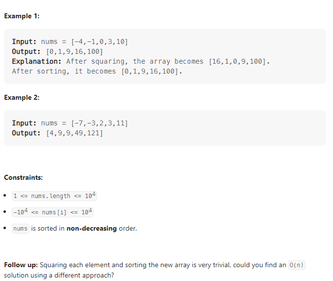

---

Given an integer array `nums` sorted in **non-decreasing** order, return *an array of **the squares of each number** sorted in non-decreasing order*.



**Solution:**

### 1. Sort

- do the power 2 operation for each numbers in the arr
- do Sort the arry.

```java

class Solution {
    public int[] sortedSquares(int[] nums) {

    for(int i = 0; i < nums.length; i++)
        nums[i] = nums[i] * nums[i];

    Arrays.sort(nums);
    return nums;
    }
}

```

### 2. O(n)

- According to the question, we know that the absolute of the number is either at the first index or last index
- in this case, we can create a new arr of nums' length
- with a loop we compare number from first index and last index, picking the number power of two with larger absolute value to the right of the array.

```java

class Solution {
    public int[] sortedSquares(int[] nums) {
        int left = 0;
        int right = nums.length -1;
        int[] ans = new int[nums.length];
        for(int i = ans.length-1; i >= 0 ; i--) {
            if(Math.abs(nums[left]) > Math.abs(nums[right])) {
                ans[i] = nums[left] * nums[left];
                left++;
            } else {
                ans[i] = nums[right] * nums[right];
                right--;
            }
        }
        return ans;
    }
}

```

---
