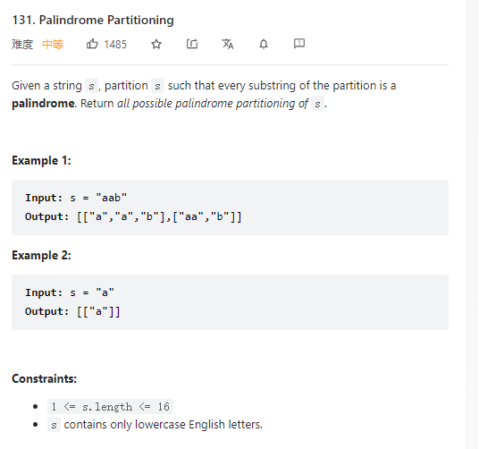

# 131. Palindrome Partitioning



**Solution:**

### 1. Backtracking

```java


class Solution {
    List<List<String>> res;
    LinkedList<String> item;
    public List<List<String>> partition(String s) {
        res = new LinkedList<>();
        item = new LinkedList<>();
        backtracking(s, 0);
        return res;
    }

    private void backtracking(String s, int start ) {
        if(start >= s.length()) {
            res.add(new ArrayList<>(item));
            return;
        }

        for(int i = start; i < s.length(); i++) {
            if(!isPalindrome(s, start, i)) continue;
            String str = s.substring(start, i+1);
            item.add(str);
            backtracking(s, i+1);
            item.removeLast();
        }
    }

    private boolean isPalindrome(String s, int start, int end) {
        for(int i = start, j = end; i < j; i++, j--) {
            if(s.charAt(i) != s.charAt(j)) return false;
        }
        return true;
    }
}
```
