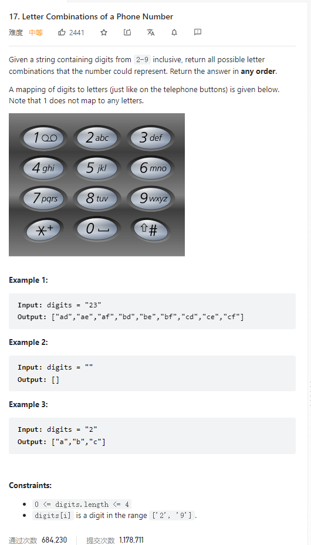

# 17. Letter Combinations of a Phone Number



**Solution:**

### 1. Backtracking

```java

class Solution {
    List<String> res;
    String [] dic;
    StringBuilder sb;
    public List<String> letterCombinations(String digits) {
        res = new LinkedList<>();
        if(digits.length() < 1) return res;
        dic = new String[] {"", "", "abc", "edf", "ghi", "jkl", "mno", "pqrs", "tuv", "wxyz"};
        sb = new StringBuilder();
        backtracking(digits, 0);
        return res;
    }
    private void backtracking(String digits, int index) {
        if(index == digits.length()) {
            res.add(sb.toString());
            return;
        }
        int digit = digits.charAt(index) - '0';
        String letters = dic[digit];


        for(int i = 0; i < letters.length(); i++) {
            sb.append(letters.charAt(i));
            backtracking(digits, index+1);
            sb.deleteCharAt(sb.length()-1);
        }
    }
}
```
