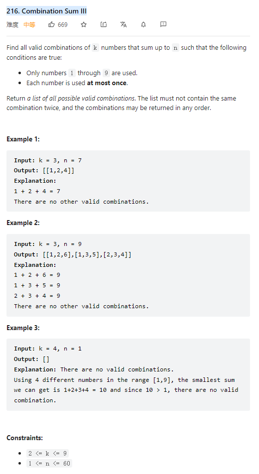

# 216. Combination Sum III



**Solution:**

### 1. Backtracking

```java

class Solution {
    List<List<Integer>> res;
    LinkedList<Integer> item;
    public List<List<Integer>> combinationSum3(int k, int n) {
        res = new LinkedList();
        item = new LinkedList();
        backtracking(k, n, 1, 0);
        return res;
    }
    private void backtracking (int k, int n, int start, int sum) {
        if(sum >= n || item.size() == k ) {
            if(sum == n && item.size() == k) {
                res.add(new ArrayList(item));
            }
            return;
        }
        for(int i = start; i < 10 ; i++) {
            item.add(i);
            backtracking(k,n,i+1,sum + i);
            item.removeLast();
        }
    }
}

```
