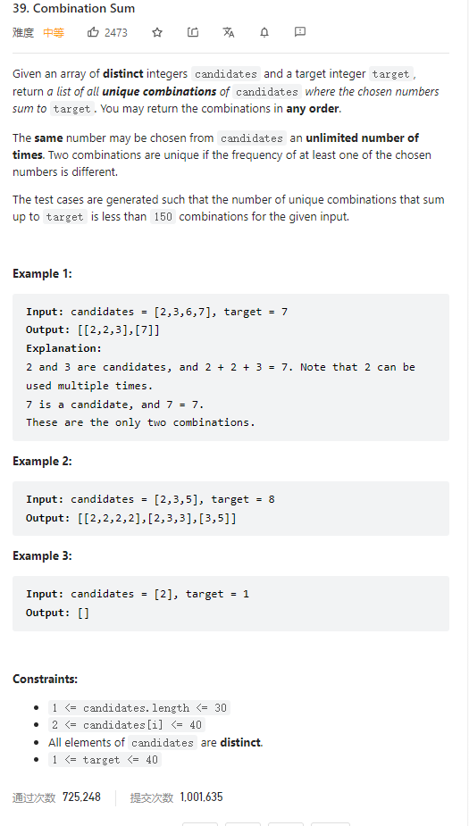

# 39. Combination Sum



**Solution:**

### 1. Backtracking

```java

class Solution {
    List<List<Integer>> res;
    LinkedList<Integer> item;
    public List<List<Integer>> combinationSum(int[] candidates, int target) {
        res = new LinkedList<>();
        item = new LinkedList<>();
        backtracking(candidates, target, 0, 0);
        return res;
    }

    private void backtracking(int[] candidates, int target, int sum, int start) {
        if(sum >= target) {
            if(sum==target) res.add(new ArrayList<>(item));
            return;
        }
        for(int i = start; i < candidates.length; i ++) {
            item.add(candidates[i]);
            backtracking(candidates, target, sum+candidates[i], i);
            item.removeLast();
        }
    }
}
```
