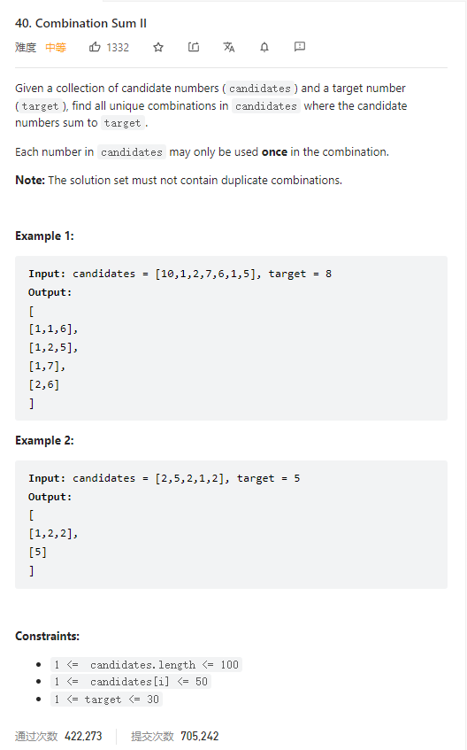

# 40. Combination Sum II



**Solution:**

### 1. Backtracking

```java

class Solution {
    List<List<Integer>> res;
    LinkedList<Integer> item;
    boolean[] used;
    public List<List<Integer>> combinationSum2(int[] candidates, int target) {
        res = new LinkedList<>();
        item = new LinkedList<>();
        used = new boolean[candidates.length];
        Arrays.fill(used, 0, used.length, false);
        Arrays.sort(candidates);
        backtracking(candidates, target, 0, 0);
        return res;
    }

    private void backtracking(int[] candidates, int target, int sum, int start) {
        if(sum >= target) {
            if(sum==target) res.add(new ArrayList<>(item));
            return;
        }
        for(int i = start; i < candidates.length; i ++) {
            if(i>0 && candidates[i] == candidates[i-1] && !used[i-1]) {
                continue;
            }
            used[i] = true;
            item.add(candidates[i]);
            backtracking(candidates, target, sum+candidates[i], i+1);
            item.removeLast();
            used[i] = false;
        }
    }
}

```
