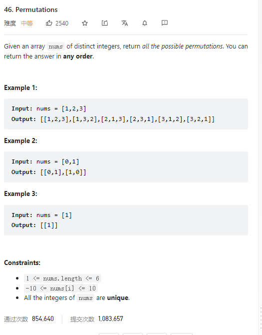

# 46. Permutations



**Solution:**

### 1. Backtracking

```java
class Solution {
    List<List<Integer>> res;
    LinkedList<Integer> item;
    boolean[] used;
    public List<List<Integer>> permute(int[] nums) {
        res = new LinkedList<>();
        item = new LinkedList<>();
        used = new boolean[nums.length];
        backtracking(nums);

        return res;
    }

    private void backtracking(int[] nums) {

        if(item.size() == nums.length) {
            res.add(new ArrayList<>(item));
            return;
        }
        for(int i = 0; i < nums.length; i++) {
            if(used[i]) continue;
            used[i] = true;
            item.add(nums[i]);
            backtracking(nums);
            item.removeLast();
            used[i] = false;
        }
    }
}
```
