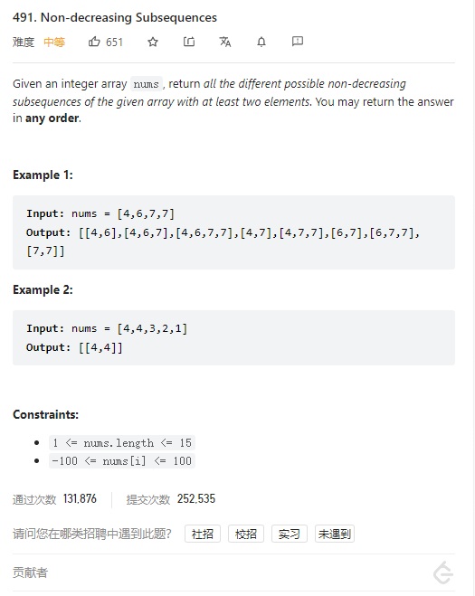

# 491. Non-decreasing Subsequences



**Solution:**

### 1. Backtracking

```java

class Solution {
    List<List<Integer>> res;
    LinkedList<Integer> item;
    public List<List<Integer>> findSubsequences(int[] nums) {
        res = new LinkedList<>();
        item = new LinkedList<>();
        backtracking(nums, 0);
        return res;
    }

    private void backtracking(int[] nums, int startIndex) {

        if(item.size() > 1) {
            res.add(new ArrayList<>(item));
        }
        //use set to deduplicate for same layer
        Set<Integer> set = new HashSet<>();
        for(int i = startIndex; i < nums.length; i++) {
            if(!item.isEmpty() && nums[i] < item.peekLast() || set.contains(nums[i]) ) {
                continue;
            }
            set.add(nums[i]);
            item.add(nums[i]);
            backtracking(nums, i+1);
            item.removeLast();
        }
    }
}

```
