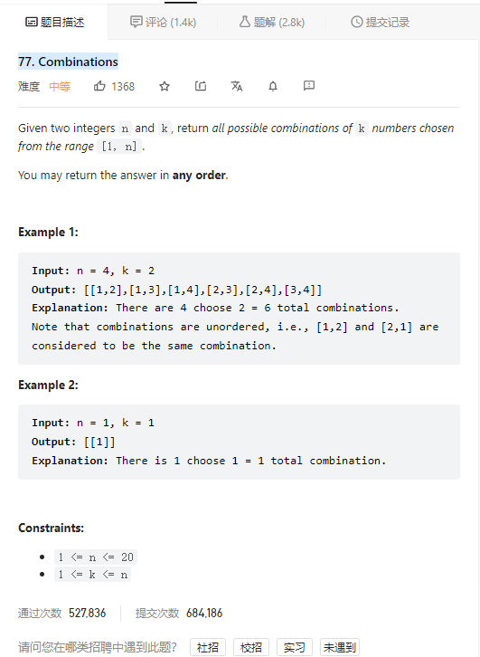

# 77. Combinations



**Solution:**

### 1. Backtracking

```java

class Solution {
    public List<List<Integer>> combine(int n, int k) {
        List<List<Integer>> res = new LinkedList();
        trackBack(res, new LinkedList(), n, k, 1);
        return res;
    }
    private void trackBack(List<List<Integer>> res, LinkedList<Integer> item, int n, int k, int start) {
        if(item.size() == k) {
            res.add(new ArrayList(item));
            return;
        }
        for(int i = start; i <= n; i++) {
            item.add(i);
            trackBack(res, item, n, k, i+1);
            item.removeLast();
        }


    }
}

```

### 2. Optimize

```java

class Solution {
    List<List<Integer>> result = new ArrayList<>();
    LinkedList<Integer> path = new LinkedList<>();
    public List<List<Integer>> combine(int n, int k) {
        combineHelper(n, k, 1);
        return result;
    }

    /**
     * 每次从集合中选取元素，可选择的范围随着选择的进行而收缩，调整可选择的范围，就是要靠startIndex
     * @param startIndex 用来记录本层递归的中，集合从哪里开始遍历（集合就是[1,...,n] ）。
     */
    private void combineHelper(int n, int k, int startIndex){
        //终止条件
        if (path.size() == k){
            result.add(new ArrayList<>(path));
            return;
        }
        for (int i = startIndex; i <= n - (k - path.size()) + 1; i++){
            path.add(i);
            combineHelper(n, k, i + 1);
            path.removeLast();
        }
    }
}

```
