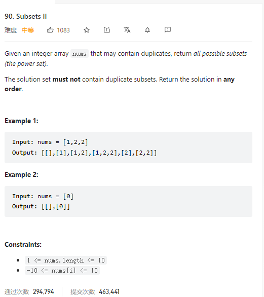

# 90. Subsets II



**Solution:**

### 1. Backtracking

```java

class Solution {
    List<List<Integer>>  res = new LinkedList<>();
    LinkedList<Integer> item = new LinkedList<>();
    public List<List<Integer>> subsetsWithDup(int[] nums) {
        Arrays.sort(nums);
        backtracking(nums, 0);
        return res;
    }

    private void backtracking(int[] nums, int startIndex) {
        if(startIndex > nums.length) return;
        res.add(new ArrayList<>(item));
        for(int i = startIndex; i < nums.length; i++) {
            if(i>startIndex && nums[i] == nums[i-1]) continue;
            item.add(nums[i]);
            backtracking(nums, i+1);
            item.removeLast();
        }
    }
}
```
