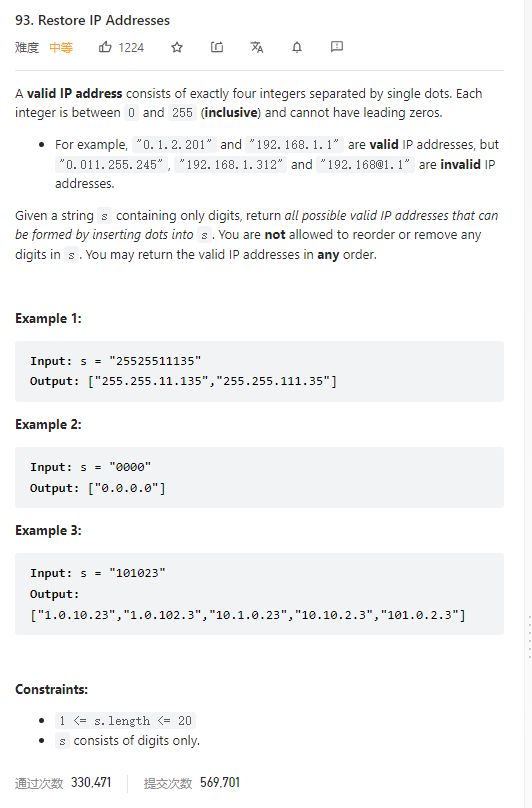

# 93. Restore IP Addresses



**Solution:**

### 1. Backtracking

```java

class Solution {
    List<String> res = new LinkedList<>();

    public List<String> restoreIpAddresses(String s) {
        backtracking(s, 0, 0);
        return res;
    }

    private void backtracking(String s, int startIndex, int pointNum) {
        if (pointNum == 3) {
            if (isValid(s, startIndex, s.length() - 1)) {
                res.add(s);
            }
            return;
        }
        for (int i = startIndex; i < s.length(); i++) {
            if (isValid(s, startIndex, i )) {
                s = s.substring(0, i + 1) + "." + s.substring(i + 1);
                backtracking(s, i + 2, pointNum+1);
                s = s.substring(0, i + 1) + s.substring(i + 2);
            } else
                break;
        }
    }

    private boolean isValid(String s, int start, int end) {


        try {
            if (start > end)
                return false;
            if (s.charAt(start) == '0' && start != end)
                return false;
            int num = Integer.parseInt(s.substring(start, end+1));
            if (num > 255)
                return false;
            return true;

        } catch (Exception e) {
            return false;
        }

    }
}
```
