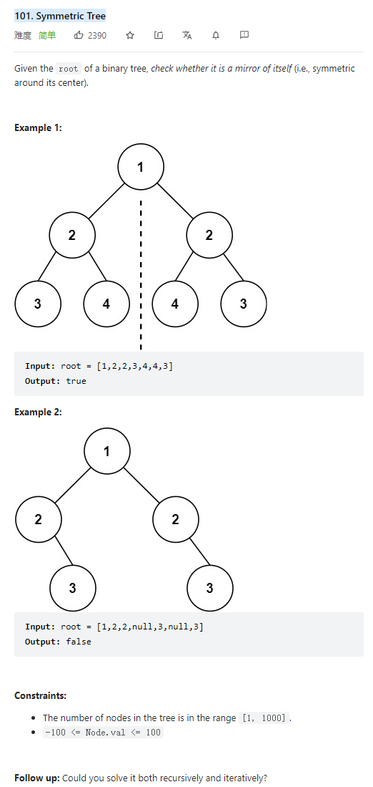

# 101. Symmetric Tree



**Solution:**

### 1. Recursion

```java

class Solution {
    public boolean isSymmetric(TreeNode root) {
        if(root == null) return true;
        return compare(root.left, root.right);
    }

    private boolean compare(TreeNode left, TreeNode right) {
        if(left == null && right == null) return true;
        if(left == null && right != null || left != null && right == null) return false;
        if(left.val != right.val) return false;

        return compare(left.left, right.right) && compare(left.right, right.left);
    }
}

```
