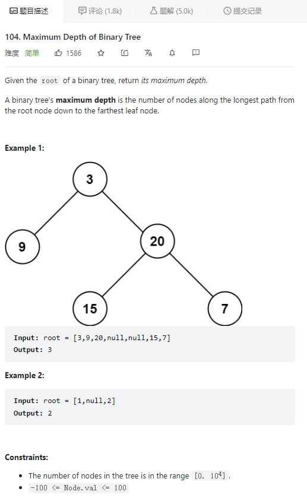

# 104. Maximum Depth of Binary Tree



**Solution:**

### 1. Recursion

```java

class Solution {
    public int maxDepth(TreeNode root) {
        return findDepth(root);
    }
    private int findDepth(TreeNode node ) {
        if(node == null) return 0;
        int left = findDepth(node.left);
        int right = findDepth(node.right);
        return 1 + Math.max(left, right);
    }
}

```

### 2. Iterative

```java

class Solution {
    public int maxDepth(TreeNode root) {
        int depth = 0;
        if(root == null) return depth;
        Deque<TreeNode> queue = new LinkedList();
        queue.offer(root);
        while(!queue.isEmpty()) {
            int size = queue.size();
            while(size > 0) {
                TreeNode tmp = queue.poll();
                if(tmp.left != null) queue.offer(tmp.left);
                if(tmp.right != null) queue.offer(tmp.right);
                size--;
            }
            depth++;
        }
        return depth;
    }
}

```
