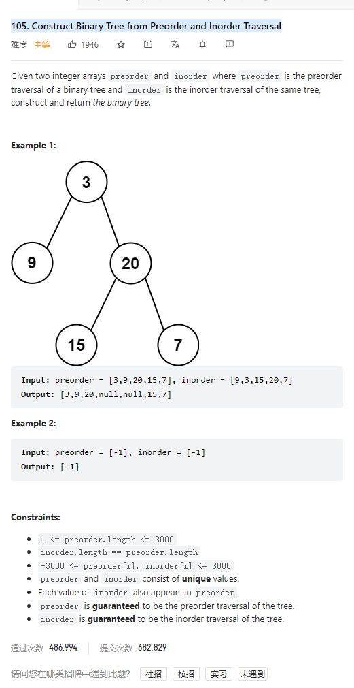

# 105. Construct Binary Tree from Preorder and Inorder Traversal



**Solution:**

### 1. Recursion

```java
class Solution {
    public TreeNode buildTree(int[] preorder, int[] inorder) {
        if(preorder.length == 0) return null;
        TreeNode root = new TreeNode(preorder[0]);
        if(preorder.length == 1) return root;
        int index = 0;
        for(index = 0; index < inorder.length; index++) {
            if(inorder[index] == preorder[0]) break;
        }
        int[] inorderLeft = Arrays.copyOfRange(inorder, 0, index);
        int[] inorderRight = Arrays.copyOfRange(inorder, index+1, inorder.length);
        int[] preorderLeft = Arrays.copyOfRange(preorder, 1, inorderLeft.length+1);
        int[] preorderRight = Arrays.copyOfRange(preorder, inorderLeft.length+1, preorder.length);

        root.left = buildTree(preorderLeft, inorderLeft);
        root.right = buildTree(preorderRight, inorderRight);
        return root;
    }
}

```
