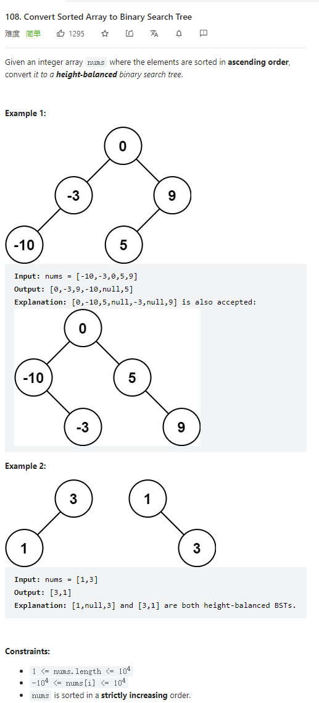

# 108. Convert Sorted Array to Binary Search Tree



**Solution:**

### 1. Recursion

```java

class Solution {
    public TreeNode sortedArrayToBST(int[] nums) {
        if(nums.length == 0) return null;
        TreeNode root = new TreeNode(nums[nums.length/2]);
        int[] left = Arrays.copyOfRange(nums, 0, nums.length/2);
        int[] right = Arrays.copyOfRange(nums, nums.length/2+1, nums.length);

        root.left = sortedArrayToBST(left);
        root.right = sortedArrayToBST(right);
        return root;

    }
}

```
