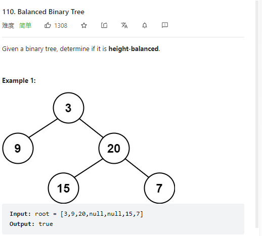

# 110. Balanced Binary Tree



**Solution:**

### 1. Recursion

```java

/**
 * Definition for a binary tree node.
 * public class TreeNode {
 *     int val;
 *     TreeNode left;
 *     TreeNode right;
 *     TreeNode() {}
 *     TreeNode(int val) { this.val = val; }
 *     TreeNode(int val, TreeNode left, TreeNode right) {
 *         this.val = val;
 *         this.left = left;
 *         this.right = right;
 *     }
 * }
 */
class Solution {
    public boolean isBalanced(TreeNode root) {
        if(root == null) return true;
        return check(root) != -1;
    }
    private int check(TreeNode root) {
        if(root == null) return 0;

        // check left subtree
        int left = check(root.left);
        if (left == -1) return -1;
        // check right subtree
        int right = check(root.right);
        if(right == -1) return -1;

        //if left - right > 1, which means their height difference is larger than 1
        // else return the max height of this subtree + 1
       return Math.abs(left - right) > 1 ? -1 : Math.max(left, right)+1;
    }
}

```
