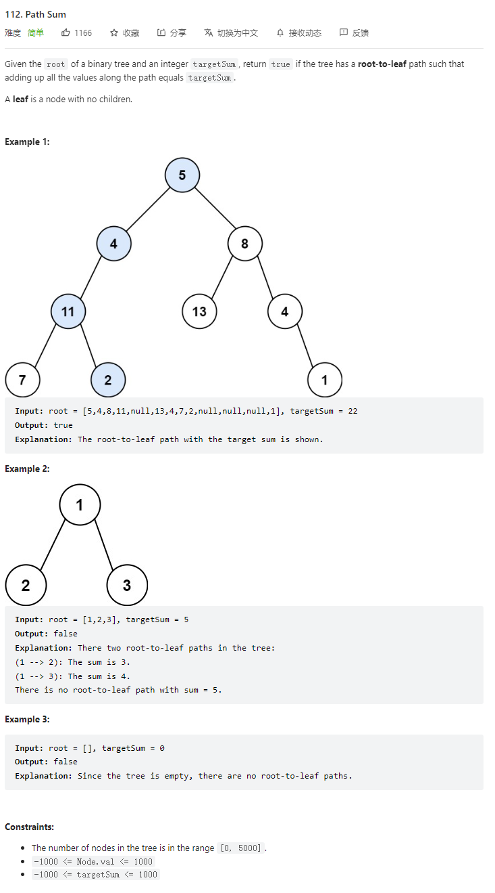

# 112. Path Sum



**Solution:**

### 1. Recursion

```java
/**
 * Definition for a binary tree node.
 * public class TreeNode {
 *     int val;
 *     TreeNode left;
 *     TreeNode right;
 *     TreeNode() {}
 *     TreeNode(int val) { this.val = val; }
 *     TreeNode(int val, TreeNode left, TreeNode right) {
 *         this.val = val;
 *         this.left = left;
 *         this.right = right;
 *     }
 * }
 */
class Solution {
    public boolean hasPathSum(TreeNode root, int targetSum) {
        if (root == null)
            return false;
        targetSum -= root.val;
        //when reaches to the end and the sum equals to target, return ture
        if (root.left == null && root.right == null && targetSum == 0)
            return true;
        //this is an OR operation, if one path is ture then return true;
        return hasPathSum(root.left, targetSum) || hasPathSum(root.right, targetSum);

    }
}

```
