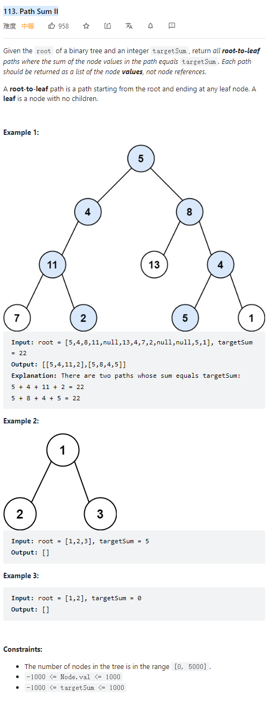

# 113. Path Sum II



**Solution:**

### 1. Recursion -> traceBack

```java


class Solution {
    List<List<Integer>> res;
    LinkedList<Integer> item;
    public List<List<Integer>> pathSum(TreeNode root, int targetSum) {

        res = new LinkedList<>();
        item = new LinkedList<>();
        helper( root, targetSum);
        return res;

    }

    private void helper(TreeNode node, int targetSum) {
        if (node == null)
            return;

        item.add(node.val);

        targetSum -= node.val;

        if (node.left == null && node.right == null && targetSum == 0 ) {
            res.add(new LinkedList<>(item));
        }
        helper(node.left, targetSum);
        helper(node.right, targetSum);
        item.removeLast(); // trace back, remove this node from the item list
    }
}

```
