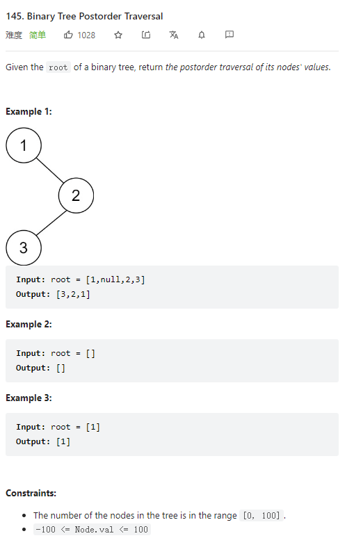

# 145. Binary Tree Postorder Traversal



**Solution:**

### 1. Recursion

- Inorder, sequence: left, right, node;
- return condition is when node is null

```java

class Solution {
    public List<Integer> postorderTraversal(TreeNode root) {
        List<Integer> res = new LinkedList();
        postorderTraversal(res, root);
        return res;
    }
    private void postorderTraversal(List<Integer> res, TreeNode node) {
        if(node == null) return;
        postorderTraversal(res, node.left);
        postorderTraversal(res, node.right);
        res.add(node.val);
    }
}

```

### 2. Iterative -> preorder reverse

- same as preoder but left node pushed into stack first

```java

class Solution {
    public List<Integer> postorderTraversal(TreeNode root) {
        List<Integer> res = new LinkedList();

        Stack<TreeNode> stack = new Stack();
        if (root != null) stack.push(root);
        while(!stack.isEmpty()) {
            TreeNode tmp = stack.pop();

            res.add(tmp.val);
            // push left first
            if(tmp.left != null){
                stack.push(tmp.left);
            }
            if(tmp.right != null) {
                stack.push(tmp.right);
            }

        }
        Collections.reverse(res);

        return res;

    }
}

```

### 3. Iterative

```java

class Solution {
    public List<Integer> postorderTraversal(TreeNode root) {
        List<Integer> res = new ArrayList<Integer>();
        if (root == null) {
            return res;
        }

        Deque<TreeNode> stack = new LinkedList<TreeNode>();
        TreeNode prev = null;
        while (root != null || !stack.isEmpty()) {
            while (root != null) {
                stack.push(root);
                root = root.left;
            }
            root = stack.pop();
            if (root.right == null || root.right == prev) {
                res.add(root.val);
                prev = root;
                root = null;
            } else {
                stack.push(root);
                root = root.right;
            }
        }
        return res;
    }
}


```
