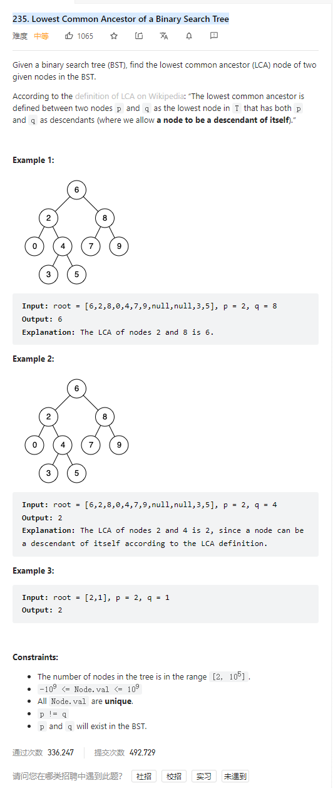

# 235. Lowest Common Ancestor of a Binary Search Tree



**Solution:**

### 1. Recursion


```java

class Solution {
    public TreeNode lowestCommonAncestor(TreeNode root, TreeNode p, TreeNode q) {
        if(root == p || root == q || root == null) return root;
        if(root.val < p.val && root.val < q.val) {
            TreeNode right = lowestCommonAncestor(root.right, p, q);
            if(right != null) return right;
        }
        if(root.val > p.val && root.val > q.val) {
            TreeNode left = lowestCommonAncestor(root.left, p, q);
            if(left != null) return left;
        }
        return root;
    }
}

```
