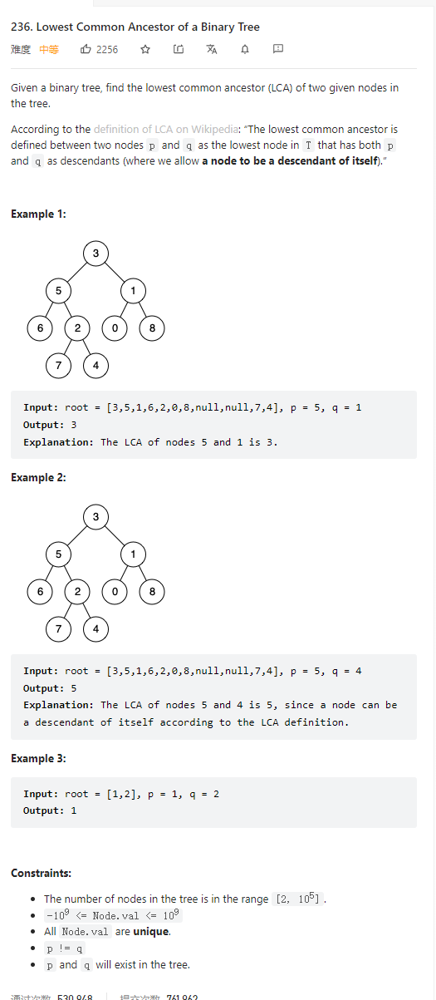

# 236. Lowest Common Ancestor of a Binary Tree



**Solution:**

### 1. Recursion -> trackBack


```java

class Solution {
    public TreeNode lowestCommonAncestor(TreeNode root, TreeNode p, TreeNode q) {
        if(root == q || root == p || root == null) return root;
        TreeNode left = lowestCommonAncestor(root.left, p, q);
        TreeNode right = lowestCommonAncestor(root.right, p, q);
        if(left != null && right != null) return root;
        if(left != null && right == null) return left;
        else if (left == null && right != null) return right;
        else return null;
    }
}

```
