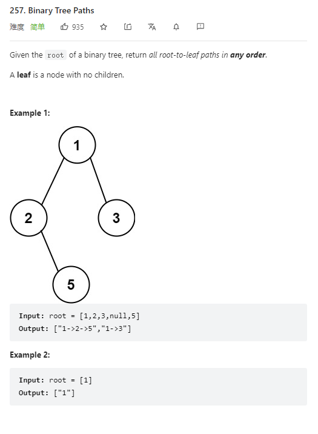

# 257. Binary Tree Paths



**Solution:**

### 1. Recursion -> trackBack


```java

class Solution {
    public List<String> binaryTreePaths(TreeNode root) {
        List<String> res = new LinkedList();
        path(res, "", root);
        return res;
    }
    private void path(List<String> list, String s, TreeNode node) {

        s = s + node.val;
        if(node.right == null && node.left == null) {
            list.add(s);
            return;
        }
        if(node.left != null) path(list, s + "->", node.left);
        if(node.right != null) path(list, s + "->", node.right);
    }
}

```
