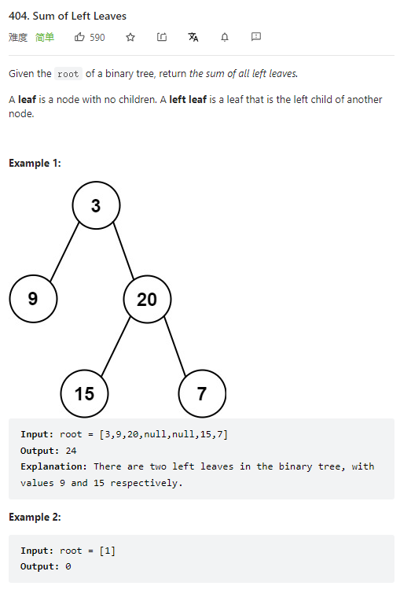

# 404. Sum of Left Leaves



**Solution:**

### 1. Recursion

- a Left Leaf has no children

```java

/**
 * Definition for a binary tree node.
 * public class TreeNode {
 *     int val;
 *     TreeNode left;
 *     TreeNode right;
 *     TreeNode() {}
 *     TreeNode(int val) { this.val = val; }
 *     TreeNode(int val, TreeNode left, TreeNode right) {
 *         this.val = val;
 *         this.left = left;
 *         this.right = right;
 *     }
 * }
 */
class Solution {
    public int sumOfLeftLeaves(TreeNode root) {
        if(root == null) return 0;
        int leftValue = 0;
        if(root.left != null && root.left.left == null && root.left.right == null ) {
            leftValue = root.left.val;
        }
        return leftValue + sumOfLeftLeaves(root.left) + sumOfLeftLeaves(root.right);
    }
}

```
