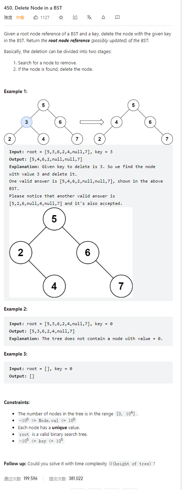

# 450. Delete Node in a BST



**Solution:**

### 1. Recursion


- NOTE: if node to be deleted has no children then make itself null
- if node has one child return the other side
- if node has both children then move the left child to the end of its right child's left tree;

```java


class Solution {
    public TreeNode deleteNode(TreeNode root, int key) {
        if(root == null) return null;
        if(root.val == key) {
            if(root.left == null) {
                return root.right;
            }else if(root.right == null) {
                return root.left;
            } else {
                TreeNode tmp = root.right;
                while(tmp.left != null) {
                    tmp = tmp.left;
                }
                tmp.left = root.left;
                root = root.right;
                return root;
            }
        }
        if(root.val > key) root.left = deleteNode(root.left, key);
        if(root.val < key) root.right = deleteNode(root.right, key);
        return root;
    }
}

```
