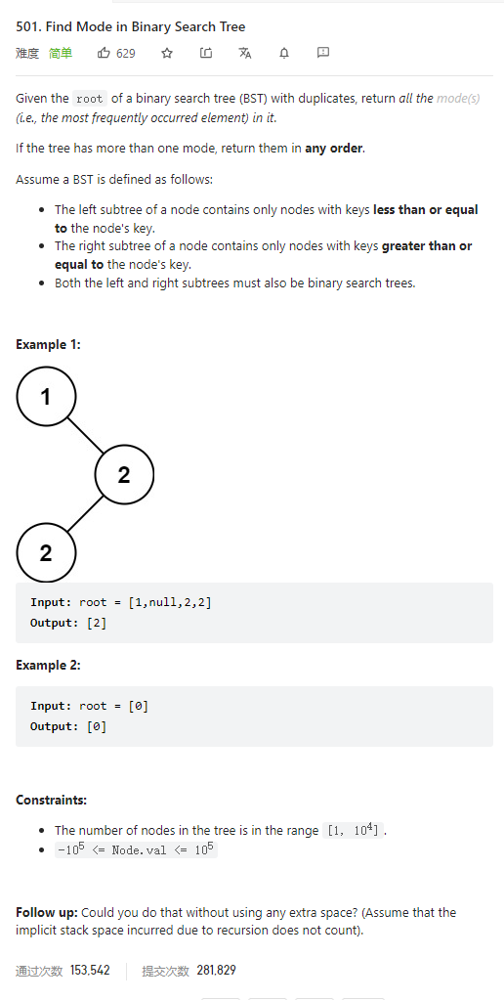

# 501. Find Mode in Binary Search Tree



**Solution:**

### 1. Recursion

```java

class Solution {
    public int[] findMode(TreeNode root) {
        Map<Integer, Integer> map = new HashMap<>();
        traversal(map, root);
        List<Integer> list = new LinkedList<>();
        int max = Integer.MIN_VALUE;

        for (Map.Entry<Integer, Integer> i : map.entrySet()) {
            if (i.getValue() > max) {
                max = i.getValue();
                list.clear();
                list.add(i.getKey());
            } else if (i.getValue() == max)
                list.add(i.getKey());
        }
        int[] result = new int[list.size()];
        for (int i = 0; i < result.length; i++) {
            result[i] = list.get(i);
        }
        return result;
    }

    private void traversal(Map<Integer, Integer> map, TreeNode root) {
        if (root == null)
            return;
        traversal(map, root.left);
        map.put(root.val, map.getOrDefault(root.val, 0) + 1);
        traversal(map, root.right);
    }
}

```
