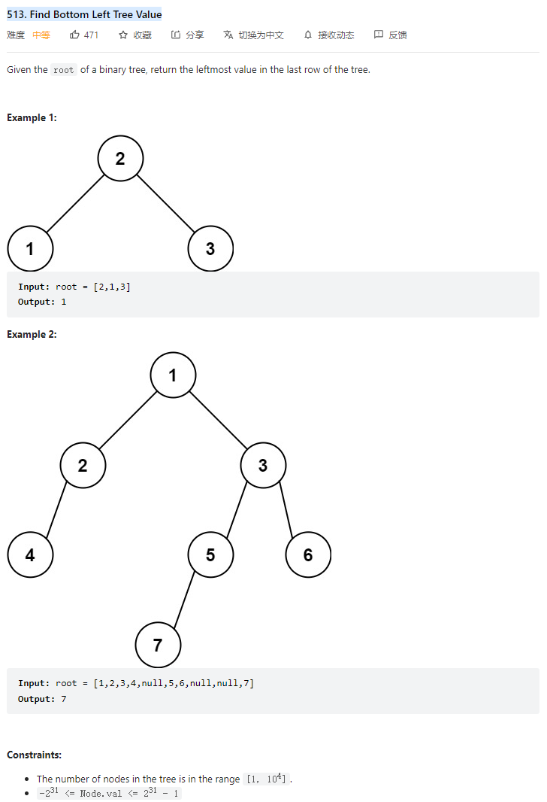

# 513. Find Bottom Left Tree Value



**Solution:**

### 1. Iteration

```java

/**
 * Definition for a binary tree node.
 * public class TreeNode {
 *     int val;
 *     TreeNode left;
 *     TreeNode right;
 *     TreeNode() {}
 *     TreeNode(int val) { this.val = val; }
 *     TreeNode(int val, TreeNode left, TreeNode right) {
 *         this.val = val;
 *         this.left = left;
 *         this.right = right;
 *     }
 * }
 */

class Solution {
    //layered template
    public int findBottomLeftValue(TreeNode root) {
        if (root == null)
            return -1;
        int ans = -1;
        Deque<TreeNode> deque = new LinkedList<>();
        deque.offer(root);

        while (!deque.isEmpty()) {
            int size = deque.size();
            //get current layer left node value, when comes to the last deepest layer, this should be the value of leftmost
            ans = deque.peek().val;
            while(size > 0) {
                TreeNode tmp = deque.poll();
                if(tmp.left != null) deque.offer(tmp.left);
                if(tmp.right != null) deque.offer(tmp.right);
                size--;
            }
        }


        return ans;
    }
}

```
