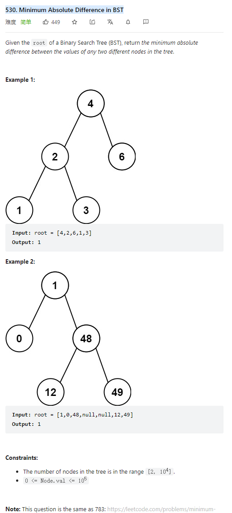

# 530. Minimum Absolute Difference in BST



**Solution:**

### 1. Recursion

```java

/**
 * Definition for a binary tree node.
 * public class TreeNode {
 *     int val;
 *     TreeNode left;
 *     TreeNode right;
 *     TreeNode() {}
 *     TreeNode(int val) { this.val = val; }
 *     TreeNode(int val, TreeNode left, TreeNode right) {
 *         this.val = val;
 *         this.left = left;
 *         this.right = right;
 *     }
 * }
 */

class Solution {
    public int getMinimumDifference(TreeNode root) {
        List<Integer> list = new ArrayList<>();
        traversal(list, root);
        int result = Integer.MAX_VALUE;
        for (int i = 1; i < list.size(); i++) {
            result = Math.min(result, list.get(i) - list.get(i-1));
         }
        return result;
    }
    private void traversal (List<Integer> list, TreeNode root) {
        if(root == null) return;
        traversal(list, root.left);
        list.add(root.val);
        traversal(list, root.right);
    }
}

```

### 2. Iteration

```java
class Solution {
    public int getMinimumDifference(TreeNode root) {
        Stack<TreeNode> st = new Stack<>();
        int min = Integer.MAX_VALUE;
        TreeNode cur = root;
        TreeNode pre = null;
        while (cur != null || !st.empty()) {
            if (cur != null) {
                st.push(cur);
                cur = cur.left;
            } else {
                cur = st.pop();
                if (pre != null) {
                    min = Math.min(min, cur.val - pre.val);
                }
                pre = cur;
                cur = cur.right;
            }
        }
        return min;
    }
}

```
