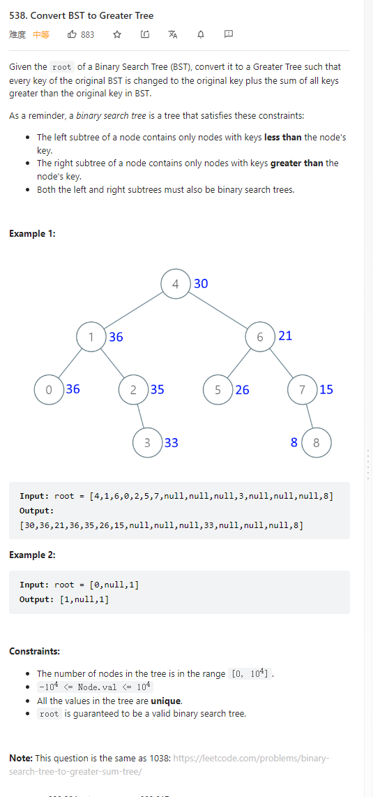

# 538. Convert BST to Greater Tree



**Solution:**

### 1. Recursion

```java

/**
 * Definition for a binary tree node.
 * public class TreeNode {
 *     int val;
 *     TreeNode left;
 *     TreeNode right;
 *     TreeNode() {}
 *     TreeNode(int val) { this.val = val; }
 *     TreeNode(int val, TreeNode left, TreeNode right) {
 *         this.val = val;
 *         this.left = left;
 *         this.right = right;
 *     }
 * }
 */

class Solution {
    int sum = 0;
    public TreeNode convertBST(TreeNode root) {
        //right mid left
        if(root == null) return null;
        root.right = convertBST(root.right);
        sum += root.val;
        root.val = sum;
        root.left = convertBST(root.left);
        return root;
    }
}

```
