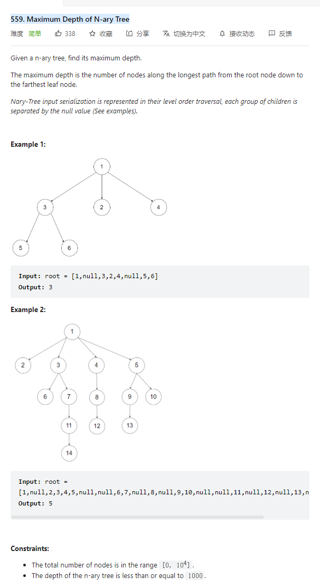

# 559. Maximum Depth of N-ary Tree



**Solution:**

### 1. Recursion

```java

class Solution {
    public int maxDepth(Node root) {
        return findDepth(root);
    }
    private int findDepth(Node node) {
        if(node == null) return 0;
        int depth = 0;
        for(int i = 0; i < node.children.size(); i++) {
            depth = Math.max(findDepth(node.children.get(i)), depth);
        }
        return depth + 1;
    }
}

```
