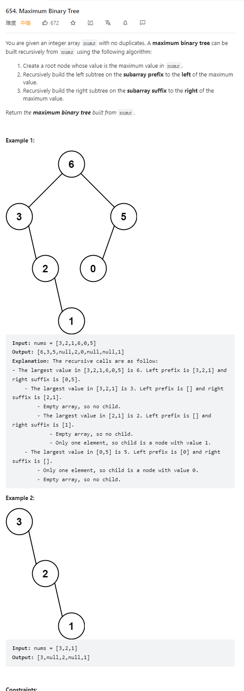

# 654. Maximum Binary Tree



**Solution:**

### 1. Iteration

```java


class Solution {
    public TreeNode constructMaximumBinaryTree(int[] nums) {
        if (nums.length == 0)
            return null;
        int index = -1;
        int max = Integer.MIN_VALUE;
        for (int i = 0; i < nums.length; i++) {
            if (max < nums[i]) {
                index = i;
                max = nums[i];
            }
        }
        TreeNode node = new TreeNode(nums[index]);
        if (nums.length == 1)
            return node;

        int[] nodeLeft = Arrays.copyOfRange(nums, 0, index);
        int[] nodeRight = Arrays.copyOfRange(nums, index + 1, nums.length);

        node.left = constructMaximumBinaryTree(nodeLeft);
        node.right = constructMaximumBinaryTree(nodeRight);

        return node;
    }
}

```
