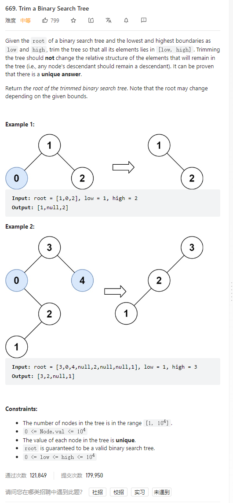

# 669. Trim a Binary Search Tree



**Solution:**

### 1. Recursion

```java

class Solution {
    public TreeNode trimBST(TreeNode root, int low, int high) {
        if(root == null) return root;
        if(root.val < low) {
            TreeNode right = trimBST(root.right, low, high);
            return right;
        }
        if(root.val > high) {
            TreeNode left = trimBST(root.left, low, high);
            return left;
        }
        root.left = trimBST(root.left, low, high);
        root.right = trimBST(root.right, low, high);
        return root;

    }
}

```
