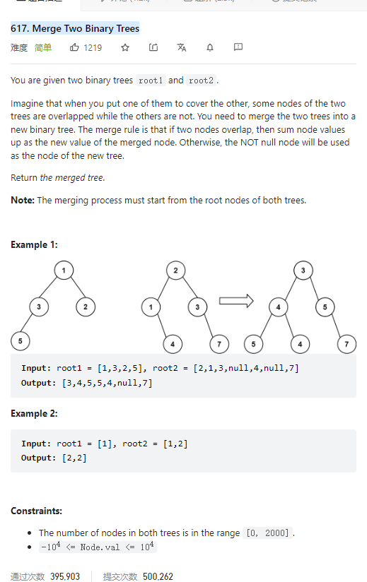

# 700. Search in a Binary Search Tree



**Solution:**

### 1. Iteration

```java

class Solution {
    public TreeNode searchBST(TreeNode root, int val) {
        while(root != null) {
            if(root.val == val) return root;
            else if(root.val > val) root = root.left;
            else root = root.right;
        }
        return null;
    }
}

```
