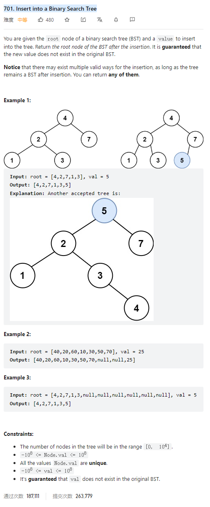

# 701. Insert into a Binary Search Tree



**Solution:**

### 1. Recursion


```java


/**
 * Definition for a binary tree node.
 * public class TreeNode {
 *     int val;
 *     TreeNode left;
 *     TreeNode right;
 *     TreeNode() {}
 *     TreeNode(int val) { this.val = val; }
 *     TreeNode(int val, TreeNode left, TreeNode right) {
 *         this.val = val;
 *         this.left = left;
 *         this.right = right;
 *     }
 * }
 */
class Solution {
    public TreeNode insertIntoBST(TreeNode root, int val) {
        if(root == null) {
            TreeNode node = new TreeNode(val);
            return node;
        }
        if(root.val > val) root.left = insertIntoBST(root.left, val);
        if(root.val < val) root.right = insertIntoBST(root.right, val);
        return root;
    }

}

```

### 2. Iteration

```java

class Solution {
    public TreeNode insertIntoBST(TreeNode root, int val) {
        if (root == null) return new TreeNode(val);
        TreeNode newRoot = root;
        TreeNode pre = root;
        while (root != null) {
            pre = root;
            if (root.val > val) {
                root = root.left;
            } else if (root.val < val) {
                root = root.right;
            }
        }
        if (pre.val > val) {
            pre.left = new TreeNode(val);
        } else {
            pre.right = new TreeNode(val);
        }

        return newRoot;
    }
}

```
