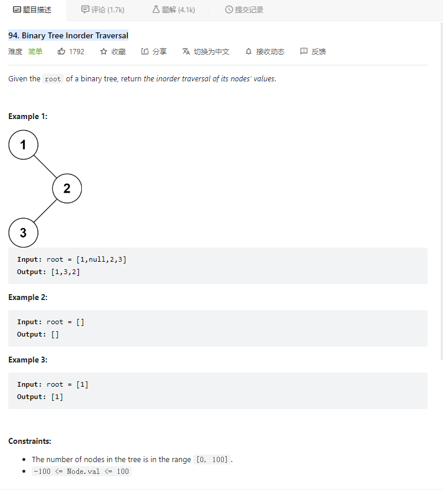

# 94. Binary Tree Inorder Traversal



**Solution:**

### 1. Recursion

- Inorder, sequence: left, node, right;
- return condition is when node is null

```java

class Solution {
    public List<Integer> inorderTraversal(TreeNode root) {
        List<Integer> res = new LinkedList();
        inorderTraversal(res, root);
        return res;
    }
    private void inorderTraversal(List<Integer> res, TreeNode node) {
        if(node == null) return;
        inorderTraversal(res, node.left);
        res.add(node.val);
        inorderTraversal(res, node.right);
    }
}

```

### 2. Iterative

- using stack and one pointer
- put all left subtree to the stack
- if reachs the end and node.right is not null, node.right is the pointer and put all left node into the stack

```java

class Solution {
    public List<Integer> inorderTraversal(TreeNode root) {
        List<Integer> res = new LinkedList();
        Stack<TreeNode> stack = new Stack();
        TreeNode cur = root;
        while(!stack.isEmpty() || cur != null) {
            while(cur != null) {
                stack.push(cur);
                cur = cur.left;
            }
            TreeNode tmp = stack.pop();
            res.add(tmp.val);
            if(tmp.right != null) {
                cur = tmp.right;
            }
        }
        return res;
    }
}

```
