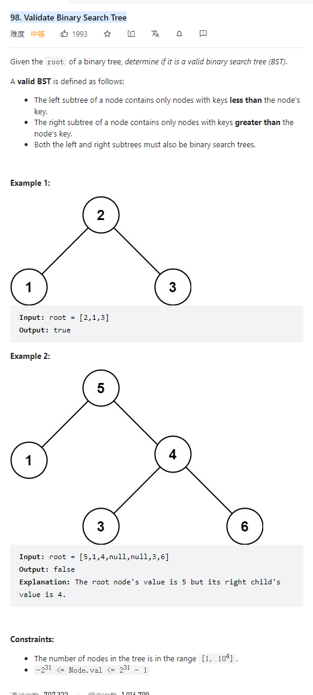

# 98. Validate Binary Search Tree



**Solution:**

### 1. Recursion

```java

class Solution {
    public boolean isValidBST(TreeNode root) {
        Stack<TreeNode> st = new Stack<>();
        TreeNode cur = root;
        TreeNode pre = null;
        while (cur != null || !st.empty()) {
            if (cur != null) {
                st.push(cur);
                cur = cur.left;
            } else {
                cur = st.pop();
                if (pre != null && cur.val <= pre.val)
                    return false;
                pre = cur;
                cur = cur.right;
            }
        }
        return true;

    }
}

```
