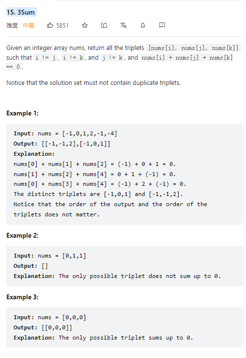

# 15. 3Sum



**Solution:**

### Two Pointers

```java

class Solution {
    public List<List<Integer>> threeSum(int[] nums) {
        //SORT array
        Arrays.sort(nums);
        List<List<Integer>> result = new LinkedList();
        for(int i = 0; i < nums.length; i++) {
            int n = nums[i];
            // if the number > 0 means the sum of 4 numbers > 0, so exit
            if(n > 0)
                break;
            //deduplication, if the number is same as [i-1], means result will be the same.
            if(i>0 && nums[i] == nums[i-1])
                continue;

            int left = i+1;
            int right = nums.length-1;
            while(left < right) {
                int sum = nums[left] + n + nums[right];
                //if sum > 0 means the right is too big
                if(sum > 0) {
                    right--;
                // if its < 0 means the left is too small
                } else if(sum < 0){
                    left++;
                // if == 0, add this to result,
                } else {
                    result.add(new LinkedList(Arrays.asList(n, nums[left], nums[right])));
                    //deduplicate
                    while(left<right && nums[right] == nums[right-1]) right--;
                    //deduplicate
                    while(left<right && nums[left] == nums[left+1]) left++;
                    right--;
                    left++;
                }
            }
        }
        return result;
    }
}

```

---
