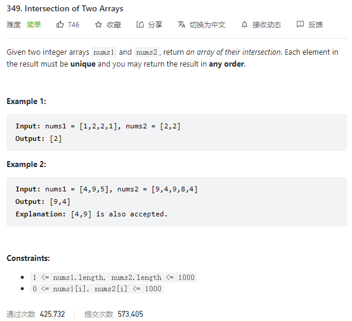

---

Given two integer arrays nums1 and nums2, return an array of their intersection. Each element in the result must be unique and you may return the result in any order.



**Solution:**

### 1. HashSet

- first loop put nums1[] into set1 and deduplicate
- second loop check if set1 contains the number in nums2[], if ture then add to the ans set
- then convert the set to an array for output.

```java

class Solution {
    public int[] intersection(int[] nums1, int[] nums2) {
        Set<Integer> set1 = new HashSet();
        Set<Integer> ans = new HashSet();

        for(int i = 0; i < nums1.length; i++) {
            set1.add(nums1[i]);
        }
        for(int i = 0; i < nums2.length; i++) {
            if(set1.contains(nums2[i]))
                ans.add(nums2[i]);
        }
        int[] result = new int[ans.size()];
        int j = 0;
        for(Integer i : ans) {
            result[j] = i;
            j++;
        }
        return result;
    }
}

```

---
