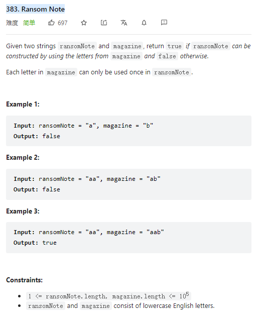

# 383. Ransom Note



**Solution:**

### 1. int[]

- use int[] to record the frequency of each char appeared in string t
- for each char in string s, minus 1 in the int[]
- if the int in the int[] smaller than 0 return false

```java

class Solution {
    public boolean canConstruct(String s, String t) {
        int[] map = new int[26];

        for(char c : t.toCharArray()) {
            map[c-'a']++;
        }
        for(char c : s.toCharArray()) {
            map[c-'a']--;
        }
        for(int i : map) {
            if(i < 0)
                return false;
        }
        return true;
    }
}

```

---
