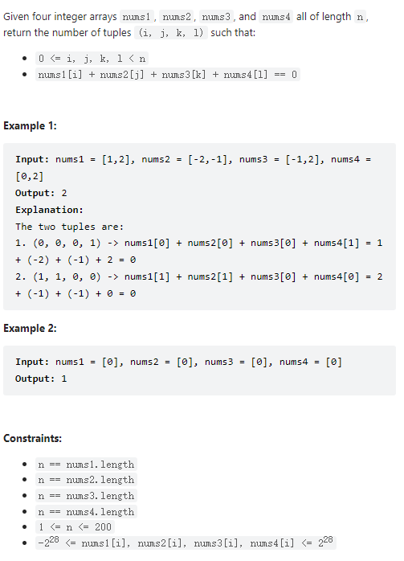

# 454. 4Sum II



**Solution:**

### 1. Hash Map

- use map to store the `sums` of the unique conbination of `nums1[]` and `nums2[]`
- using the second nested loop to get the unique conbination of `nums3[]` and `nums4[]`
- if the `map` contains the key `of 0 - sum` of `nums3[]` and `nums4[]` which means the sum of four numbers is 0
- add the value to `ans`

```java

class Solution {
    public int fourSumCount(int[] nums1, int[] nums2, int[] nums3, int[] nums4) {
            Map<Integer, Integer> map = new HashMap();
            int ans = 0;
            for(int i = 0; i < nums1.length; i++) {
                for(int j = 0; j < nums2.length; j++) {
                    map.put(nums1[i] + nums2[j], map.getOrDefault(nums1[i] + nums2[j], 0) + 1);
                }
            }
            for(int i = 0; i < nums3.length; i++) {
                for(int j = 0; j < nums4.length; j++) {
                    int tmp = nums3[i] + nums4[j];
                    if(map.containsKey(0-tmp)) {
                        ans += map.get(0-tmp);
                    }
                }
            }
            return ans;
    }
}

```

---
