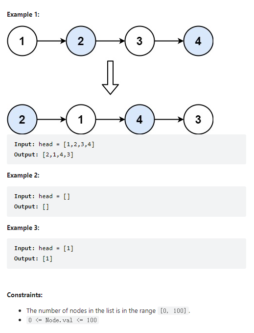

# 24. Swap Nodes in Pairs

Given a linked list, swap every two adjacent nodes and return its head. You must solve the problem without modifying the values in the list's nodes (i.e., only nodes themselves may be changed.)



**Solution:**

### 1. Iterative


```java

class Solution {
    public ListNode swapPairs(ListNode head) {
        ListNode dummy = new ListNode(-1, head);
        ListNode pre = dummy;
        ListNode cur = head;

        while(cur != null && cur.next != null) {
            ListNode tmp = cur.next.next;
            pre.next = cur.next;
            cur.next.next = cur;
            cur.next = tmp;
            pre = cur;
            cur = cur.next;
        }

        return dummy.next;

    }
}

```

### 2. Recursion

```java

class Solution {
    public ListNode swapPairs(ListNode head) {
        if(head == null || head.next == null){
            return head;
        }
        ListNode next = head.next;
        head.next = swapPairs(next.next);
        next.next = head;
        return next;
    }
}

```

---
