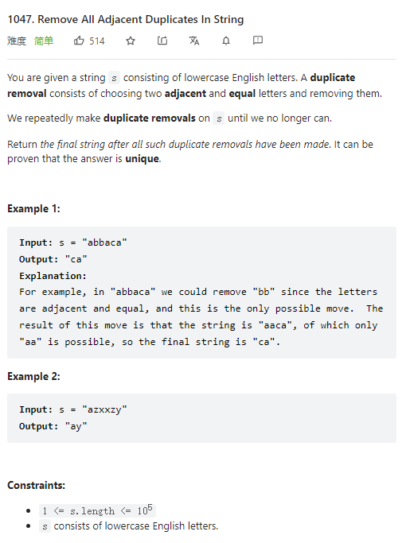

# 1047. Remove All Adjacent Duplicates In String



**Solution:**

### 1. Stack


```java

class Solution {
    public String removeDuplicates(String s) {
        String ans = "";
        Stack<Character> stack = new Stack();
        for(char c : s.toCharArray()) {
            if(!stack.isEmpty() && stack.peek() == c) stack.pop();
            else stack.push(c);
        }
        while(!stack.isEmpty()) {
            ans = stack.pop() + ans;
        }
        return ans;
    }
}

```
