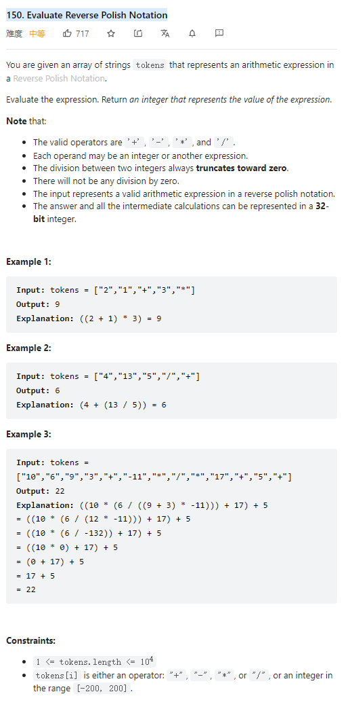

# 150. Evaluate Reverse Polish Notation



**Solution:**

### 1. Stack

- push the number to stack until meet the operator
- pop two numbers for this operation and push the result back to stack
- the last remaining number would be the result


```java

class Solution {
    public int evalRPN(String[] tokens) {
        Stack<Integer> stack = new Stack();
        for(String s: tokens) {
            if(!"+-*/".contains(s)) {
                stack.push(Integer.parseInt(s));
            }
            else {
                int secondNum = stack.pop();
                int firstNum = stack.pop();
                switch (s) {
                    case "+" :
                        stack.push(firstNum + secondNum);
                        break;
                    case "-" :
                        stack.push(firstNum - secondNum);
                        break;
                    case "*" :
                        stack.push(firstNum * secondNum);
                        break;
                    case "/" :
                        stack.push(firstNum / secondNum);
                        break;
                }
            }
        }
        return stack.pop();
    }
}

```
