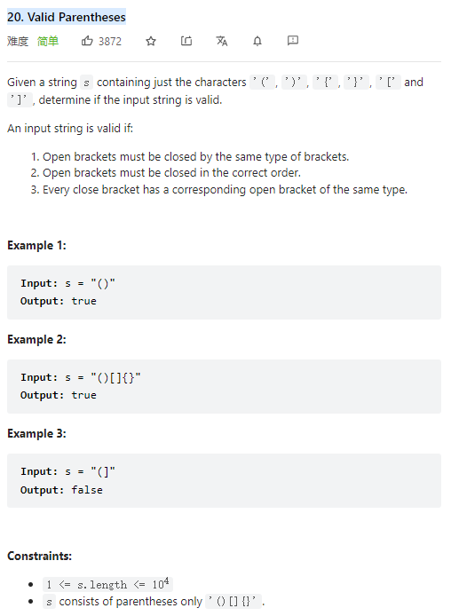

# 20. Valid Parentheses



**Solution:**

### 1. Stack

- when meet `"({["` push the `")}]"` to the stack
- when meet the corresponding close parethesis then pop it from the stack
  

```java

class Solution {
    public boolean isValid(String s) {
        Stack<Character> stack = new Stack();
        for(char c : s.toCharArray()){

            switch (c) {
                case '(':
                    stack.push(')');
                    break;
                case '[':
                    stack.push(']');
                    break;
                case '{':
                    stack.push('}');
                    break;
                default:
                    if(stack.isEmpty() || stack.pop() != c) return false;
            }

        }

        return stack.isEmpty();
    }
}

```
