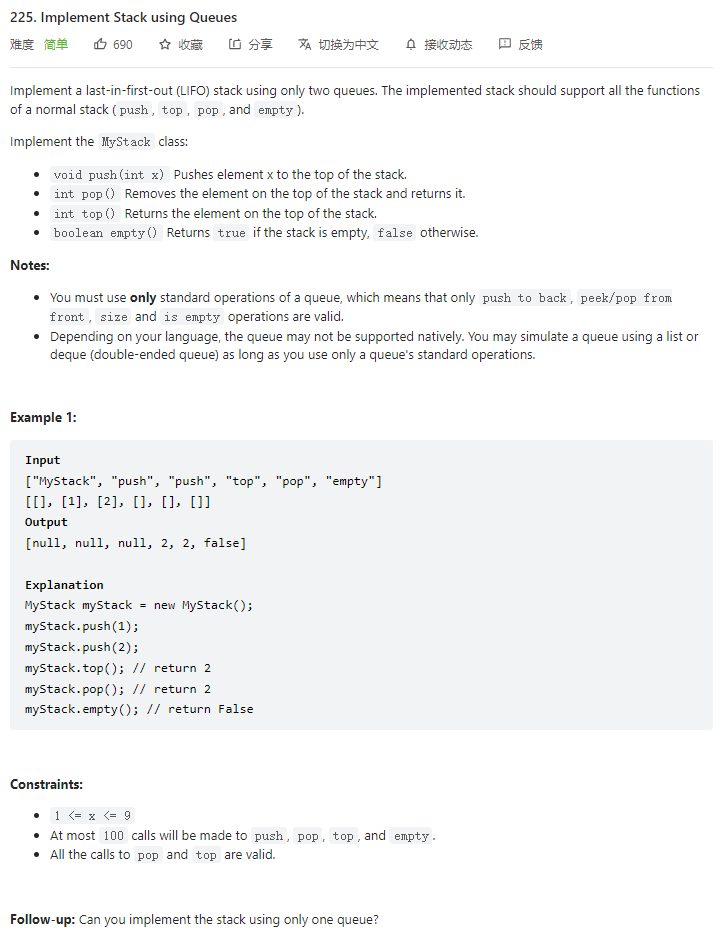

# 225. Implement Stack using Queues



**Solution:**

### 1. Two Queues


```java

class MyStack {

    Queue<Integer> queue1;
    Queue<Integer> queue2;
    public MyStack() {
        queue1 = new LinkedList();
        queue2 = new LinkedList();
    }

    public void push(int x) {
        queue2.offer(x);
        while(!queue1.isEmpty()) {
            queue2.offer(queue1.poll());
        }
        Queue tmp = queue2;
        queue2 = queue1;
        queue1 = tmp;
    }

    public int pop() {
       return queue1.poll();
    }

    public int top() {
       return queue1.peek();
    }

    public boolean empty() {
        return queue1.isEmpty();
    }
}

/**
 * Your MyStack object will be instantiated and called as such:
 * MyStack obj = new MyStack();
 * obj.push(x);
 * int param_2 = obj.pop();
 * int param_3 = obj.top();
 * boolean param_4 = obj.empty();
 */

```

---
