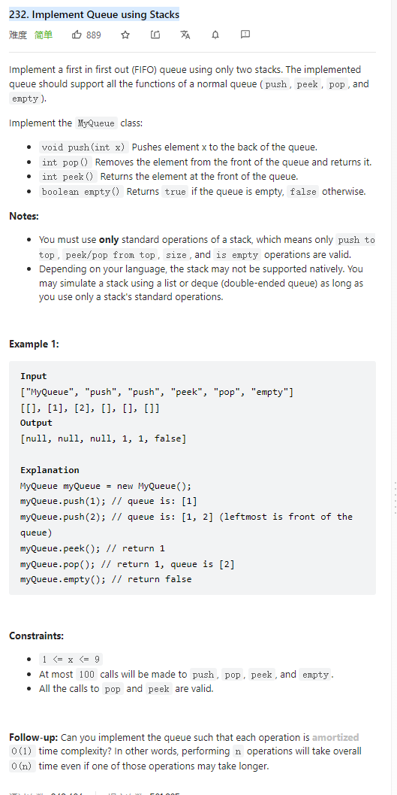

# 232. Implement Queue using Stacks



**Solution:**

### 1. Two Stacks


```java

class MyQueue {

    Stack<Integer> stackIn;
    Stack<Integer> stackOut;
    public MyQueue() {
        stackIn = new Stack();
        stackOut = new Stack();
    }

    public void push(int x) {
        stackIn.push(x);
    }

    public int pop() {
        if(stackOut.isEmpty()) {
            while(!stackIn.isEmpty()) {
                stackOut.push(stackIn.pop());
            }
        }
        return stackOut.pop();
    }

    public int peek() {
        if(stackOut.isEmpty()) {
            while(!stackIn.isEmpty()) {
                stackOut.push(stackIn.pop());
            }
        }
        return stackOut.peek();
    }

    public boolean empty() {
        return stackOut.isEmpty() && stackIn.isEmpty();
    }
}

```

---
