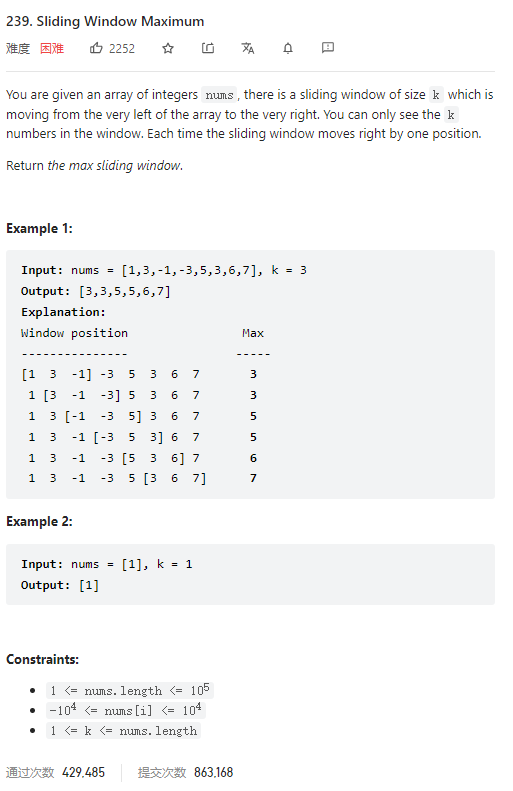

# 239. Sliding Window Maximum



**Solution:**

### 1. Deque

- design a deque
- for this question we only need to maintain the largest number in the queue
- in this case, we need to check if this largest number is about to be outside the queue, if so, remove it
- when adding element to the queue, check if the last element is smaller than this element, if so, remove the last

  

```java

class Solution {

    class MyQueue {
        Deque<Integer> deque = new LinkedList();
        void poll(int val) {
            if(!deque.isEmpty() && val == deque.peek())
                deque.poll();
        }
        void add(int val) {
            while(!deque.isEmpty() && val > deque.getLast()){
                deque.removeLast();
            }
            deque.add(val);
        }
        int peek(){
            return deque.peek();
        }
    }


    public int[] maxSlidingWindow(int[] nums, int k) {
        if(nums.length == 1) return nums;

        int res [] = new int[nums.length-k+1];
        int num = 0;
        MyQueue myQueue = new MyQueue();

        for(int i = 0 ; i < k; i++) {
            myQueue.add(nums[i]);
        }
        res[num++] = myQueue.peek();
        for(int i = k; i < nums.length; i++) {
            myQueue.poll(nums[i-k]);
            myQueue.add(nums[i]);

            res[num++] = myQueue.peek();

        }
        return res;

    }
}

```
